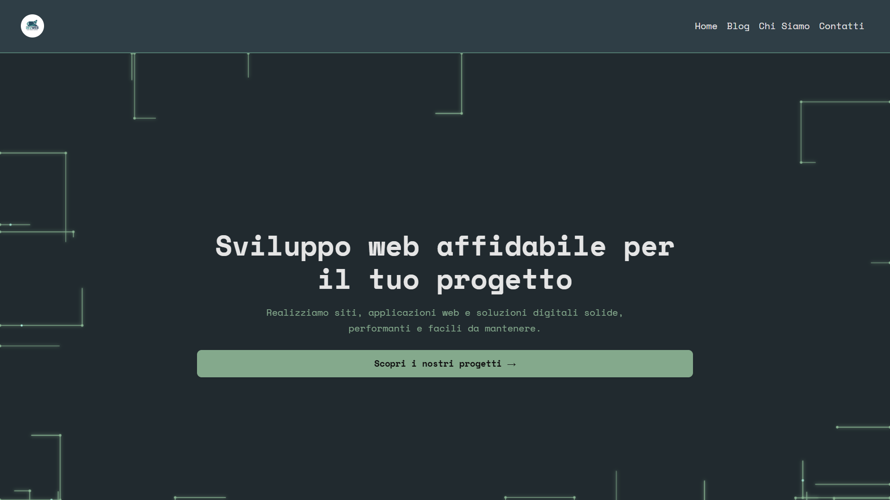
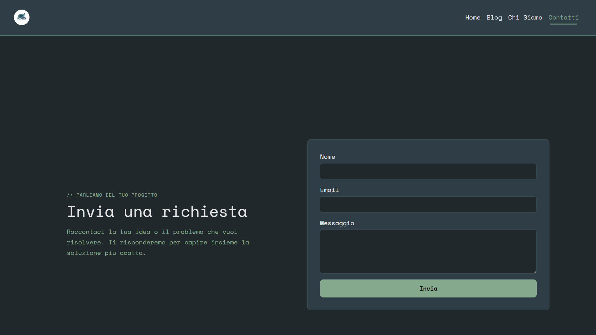
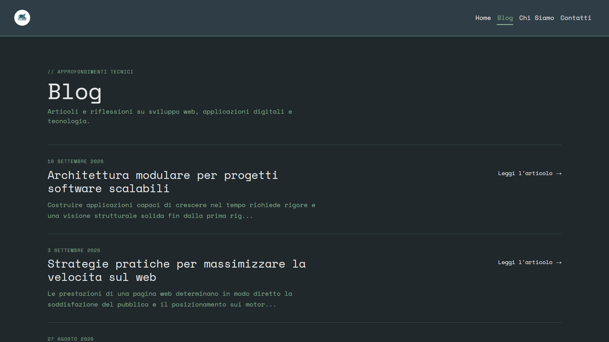

# startup-website



Multi-page company website built through a classic server-side request/response flow: defined routes with dedicated controllers, rendered content through reusable Blade templates with a shared layout, implemented a blog section with article detail pages backed by in-memory data, and added a "Chi Siamo" team page. Integrated a contact form with full server-side validation that constructs an email mailable and delivers it to Mailtrap for inspecting outbound messages during development. Automated the main flows with a test suite covering the core routes.

## Screenshots

Add screenshots here (drop images into the `screenshots` folder and reference them with relative paths):





## Installazione e avvio

```bash
composer setup
npm run dev
```

Oppure manualmente:

```bash
composer install
cp .env.example .env
php artisan key:generate
php artisan migrate
npm install
npm run build
php artisan serve
```
